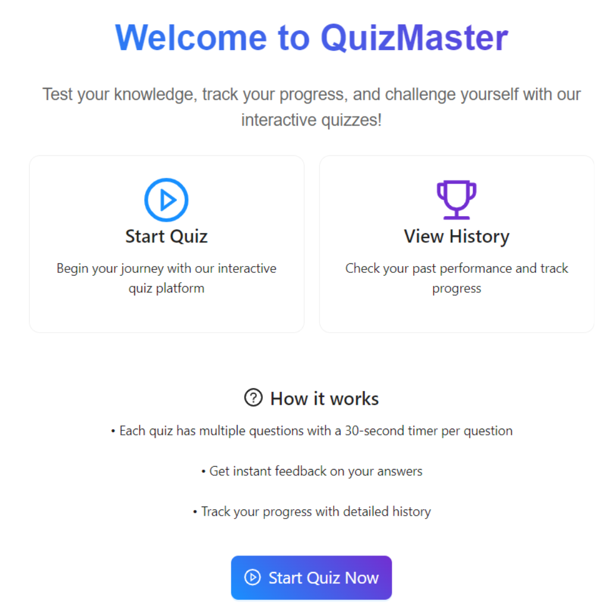

# QuizMaster



## Overview

The **QuizMaster** is a dynamic web application designed for users to take quizzes, track their progress, and receive immediate feedback. The platform allows users to view their quiz history and provides a timer-based experience to enhance engagement.

> ⚛️ **This is a basic React project that focuses on implementing core JavaScript concepts** like state management, event handling, and routing in a web application.

### Key Features

#### **1. Quiz Creation & Management**
- Display a list of questions for each quiz.
- Show a detailed attempt history with past answers and scores.

#### **2. User Interaction**
- Users can select answers and get **instant feedback** on their choices.
- Implement timer-based quizzes (e.g., 30 seconds per question) for an added challenge.

#### **3. Progress Tracking**
- Display a **scoreboard** showing the user's performance after each quiz attempt.
- Track user progress over multiple quiz attempts, including past scores and improvements.

#### **4. Bonus Challenges**
- Store quiz attempt data using **IndexedDB**, ensuring quiz history is saved even after page refreshes.

## Getting Started

### Prerequisites

- Ensure you have **Node.js** installed on your machine.
- Make sure you have **npm** (Node Package Manager) or **yarn** installed.

### Installation

1. Clone this repository:

   ```bash
   git clone https://github.com/yourusername/quiz-platform.git
